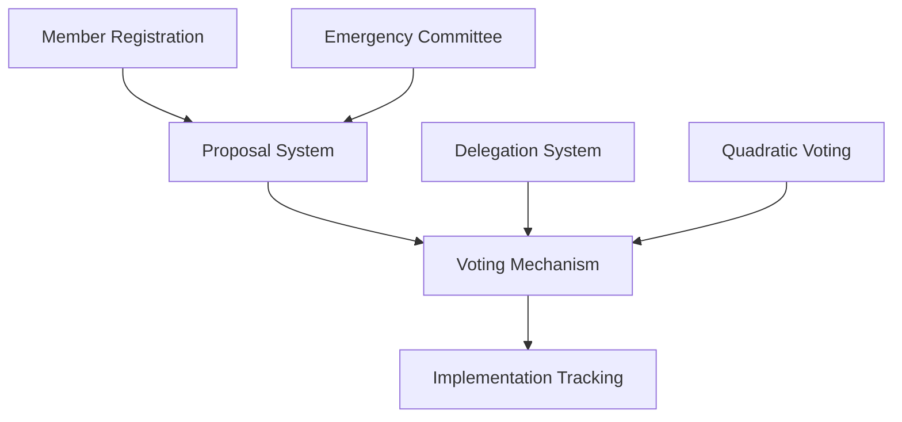

# PulseDAO Health Governance

A decentralized governance framework designed for health cooperatives to make transparent, democratic decisions about resource allocation, policy changes, and operational matters.

## Overview

PulseDAO enables health cooperative members to:
- Submit and vote on proposals
- Delegate voting power to healthcare experts
- Track implementation of approved decisions
- Participate in emergency decision-making processes

The system uses quadratic voting to balance stakeholder influence while maintaining the high standards of accountability required in healthcare organizations.

## Architecture

The governance system is built around four main components that work together to enable secure and transparent decision-making:



### Core Components
1. **Member Management**: Handles registration, verification, and stake management
2. **Proposal System**: Manages proposal lifecycle from creation to implementation
3. **Voting Mechanism**: Implements quadratic voting with delegation capabilities
4. **Emergency Governance**: Special procedures for urgent decisions

## Contract Documentation

### pulse-dao.clar

The main governance contract that implements the core functionality of PulseDAO.

#### Key Features
- Member registration and verification
- Proposal creation and management
- Quadratic voting system
- Vote delegation
- Emergency proposal handling
- Implementation tracking

#### Access Control
- **Admin**: Can verify members, update governance parameters, and transfer admin rights
- **Emergency Committee**: Can create emergency proposals
- **Verified Members**: Can create proposals, vote, and delegate voting power
- **Proposers**: Can mark their proposals as implemented

## Getting Started

### Prerequisites
- Clarinet
- Stacks wallet
- Member registration in PulseDAO

### Basic Usage

1. **Register as a Member**
```clarity
(contract-call? .pulse-dao register-member "healthcare-provider" u1000)
```

2. **Create a Proposal**
```clarity
(contract-call? .pulse-dao create-proposal 
    "New Treatment Protocol" 
    "Implement updated treatment guidelines" 
    "clinical" 
    false 
    u100 
    none)
```

3. **Vote on a Proposal**
```clarity
(contract-call? .pulse-dao vote u1 "yes")
```

## Function Reference

### Member Management
- `register-member`: Register as a new member
- `verify-member`: Verify a member (admin only)
- `add-stake`: Add stake to your membership

### Proposal Management
- `create-proposal`: Create a new proposal
- `finalize-proposal`: Conclude voting on a proposal
- `mark-implemented`: Mark a proposal as implemented

### Voting
- `vote`: Cast a vote on a proposal
- `delegate-vote`: Delegate voting power
- `remove-delegation`: Remove an active delegation

### Administrative
- `update-governance-params`: Update governance parameters
- `update-emergency-committee`: Modify emergency committee
- `transfer-admin`: Transfer admin rights

## Development

### Local Testing
1. Initialize Clarinet project
```bash
clarinet new pulse-dao && cd pulse-dao
```

2. Deploy contracts
```bash
clarinet deploy
```

3. Run test suite
```bash
clarinet test
```

## Security Considerations

### Limitations
- Single-level delegation to prevent circular dependencies
- Minimum stake requirements for voting
- Quadratic voting to prevent stake concentration

### Best Practices
1. Always verify member status before interactions
2. Monitor delegation chains
3. Review proposal parameters carefully
4. Use appropriate voting weights based on stake
5. Respect emergency proposal procedures

### Emergency Procedures
- Emergency proposals require Emergency Committee approval
- Higher scrutiny for emergency decisions
- Expedited voting periods possible for urgent matters